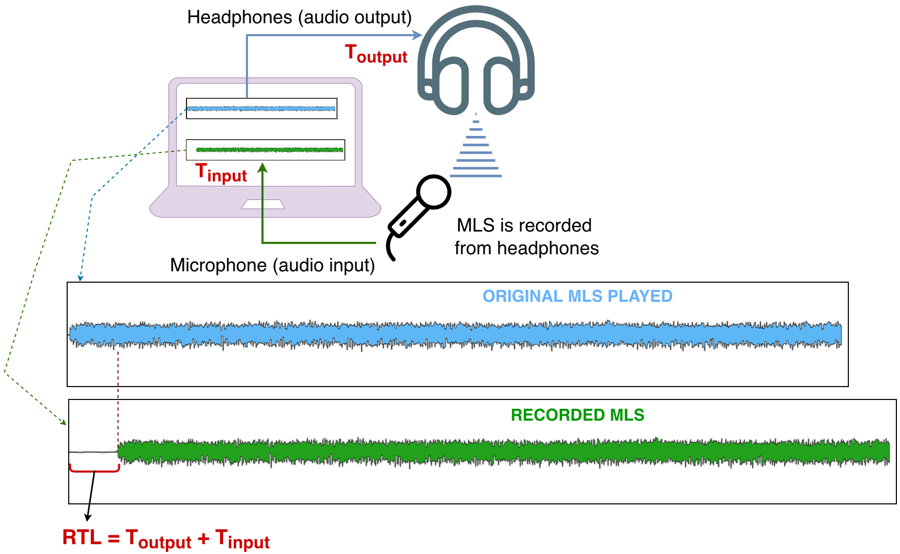

# @hi-audio/latency-test web component

A Web Component for measuring browser round-trip audio latency in Web Audio applications.

## Status

> **Work in progress.** The `@hi-audio/latency-test` package is not yet published. The API described below is the intended design. The current codebase contains a working prototype (`npm run dev`) and the full package planning is underway.

## What it does



- Measures round-trip browser audio latency using an [MLS (Maximum Length Sequence)](https://en.wikipedia.org/wiki/Maximum_length_sequence) signal and cross-correlation
- Designed for integration into Web Audio and DAW-like web applications
- Headless-first API: `start()` / `stop()` methods and custom events — no built-in UI
- Reports latency in milliseconds and a reliability ratio in dB (values above `18 dB` indicate a trustworthy measurement)

## Planned usage (draft)

```html
<latency-test id="lt"></latency-test>
<button onclick="document.getElementById('lt').start()">Test</button>

<script type="module">
  import '@hi-audio/latency-test'

  document.getElementById('lt').addEventListener('latency-result', (e) => {
    console.log(e.detail.latency, 'ms — ratio:', e.detail.ratio, 'dB')
  })
</script>
```

Multiple consecutive tests with aggregate statistics:

```html
<latency-test id="lt" number-of-tests="5"></latency-test>

<script type="module">
  import '@hi-audio/latency-test'

  const lt = document.getElementById('lt')

  lt.addEventListener('latency-result', (e) => {
    console.log('run:', e.detail.latency, 'ms')
  })

  lt.addEventListener('latency-complete', (e) => {
    const { mean, std, min, max } = e.detail
    console.log(`mean ${mean.toFixed(2)} ms · std ${std.toFixed(2)} · min ${min.toFixed(2)} · max ${max.toFixed(2)}`)
  })

  lt.start()
</script>
```

## Documentation

Full integration docs are published via VitePress (see `docs/`):

- **API reference** — attributes, methods, events, algorithm constants: `docs/api.md`
- **Framework examples** — Vanilla JS, React, Vue, Svelte, Angular, Next.js: `docs/examples/`
- **Installation** — npm, CDN, AudioContext sharing: `docs/install.md`
- Live demo: coming soon

## Local development

Run the prototype app:

```bash
npm install
npm run dev
# open http://localhost:1234
```

Run the documentation site:

```bash
npm run docs:dev
# open http://localhost:5173
```

Other commands:

```bash
npm run build         # production build (demo app)
npm run docs:build    # build VitePress docs
npm run docs:preview  # preview built docs locally
```

**Requirement:** Node.js v14 or above.

## Repository scope

This repository contains the prototype implementation, full package planning (see `CLAUDE_REVIEW.md`), and the VitePress documentation site. The root README is intentionally concise — detailed integration guidance lives in `docs/`. 

## Roadmap

- [x] Prototype: MLS signal generation, cross-correlation via Web Worker, MediaRecorder capture
- [ ] Web Component refactor: `<latency-test>` Custom Element, Shadow DOM, instance-based architecture
- [ ] AudioWorklet backend: dual-channel raw PCM capture (mic + reference loopback) replacing MediaRecorder
- [ ] npm package publication as `@hi-audio/latency-test`
- [ ] Additional signal types: chirp (logarithmic sine sweep), Golay complementary sequences

## Research origin

This project originates from research on browser round-trip audio latency presented at [WAC 2025](https://wac-2025.ircam.fr/). The original proof-of-concept app remains available at [gilpanal/weblatencytest](https://github.com/gilpanal/weblatencytest). This repository is the Web Component development branch. The same measurement method is also used in the [Hi-Audio online platform](https://hiaudio.fr).

> Gil Panal, J. M., Richard, G., & David, A. (2025). *A Maximum Length Sequence–Based Method for Robust Round-Trip Latency Estimation in online Digital Audio Workstations.* WAC 2025. https://doi.org/10.5281/zenodo.17642262

---

## More info about Hi-Audio

1. Article at EURASIP Journal on Audio, Speech, and Music Processing: [https://link.springer.com/article/10.1186/s13636-026-00459-0](https://link.springer.com/article/10.1186/s13636-026-00459-0)
2. Hi-Audio online platform: https://hiaudio.fr
3. News: https://hiaudio.fr/static/news.html
4. Hi-Audio web-app repository: https://github.com/idsinge/hiaudio_webapp
5. Python/Google Colab notebook for MLS-based latency estimation: https://gist.github.com/gilpanal/f6a64a8fe797190bba22123dfea29611

---

## Acknowledgments

This work is developed as part of the project *Hybrid and Interpretable Deep Neural Audio Machines*, funded by the **European Research Council (ERC)** under the European Union's Horizon Europe research and innovation programme (grant agreement No. 101052978).


We also thank [Louis Bahrman](https://github.com/Louis-Bahrman) for his collaboration on this project, including his contributions to the [Python/Google Colab notebook for MLS-based latency estimation](https://gist.github.com/gilpanal/f6a64a8fe797190bba22123dfea29611).

---

## How to cite

If you use or reference the data or findings from this repository, please cite the published conference paper. You may also cite the repository directly.

> Gil Panal, J. M., Richard, G., & David, A. (2025). A Maximum Length Sequence–Based Method for Robust Round-Trip Latency Estimation in online Digital Audio Workstations. In *Proceedings of the Web Audio Conference (WAC 2025)*. https://doi.org/10.5281/zenodo.17642262

**BibTeX:**

```bibtex
@inproceedings{GilPanal2025wac,
  author    = {Gil Panal, Jos{\'e} M. and Richard, Ga{\"e}l and David, Aur{\'e}lien},
  title     = {A Maximum Length Sequence--Based Method for Robust Round-Trip Latency Estimation in online Digital Audio Workstations},
  booktitle = {Proceedings of the Web Audio Conference (WAC 2025)},
  year      = {2025},
  doi       = {10.5281/zenodo.17642262},
  url       = {https://doi.org/10.5281/zenodo.17642262}
}
```

A preprint version is also available at: [https://hal.science/hal-05154354](https://hal.science/hal-05154354)

**Repository citation:**

> Gil Panal, J. M., Richard, G., & David, A. (2024). *weblatencytest* [Software repository]. GitHub. https://github.com/gilpanal/weblatencytest

```bibtex
@misc{GilPanal2024weblatencytest,
  author = {Gil Panal, Jos{\'e} M. and Richard, Ga{\"e}l and David, Aur{\'e}lien},
  title  = {weblatencytest},
  year   = {2024},
  url    = {https://github.com/gilpanal/weblatencytest}
}
```

---

## License

This project is licensed under the [MIT License](LICENSE).  
Copyright (c) 2024 Hi-Audio.
